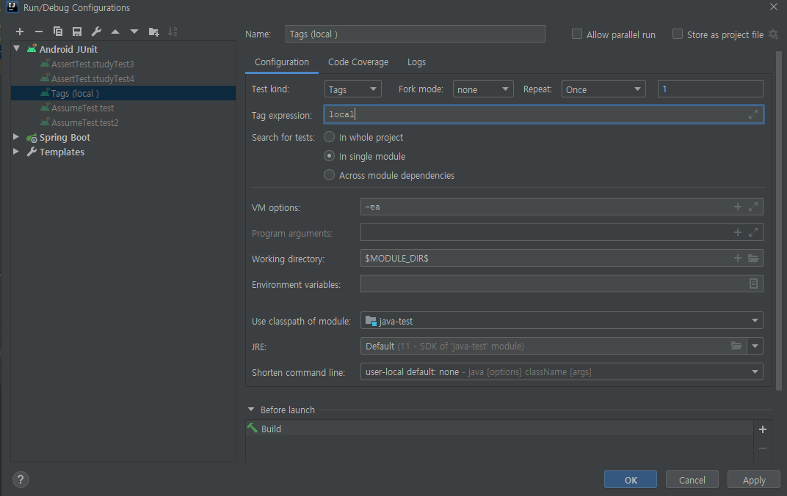

#Java Application Test  

### 개요 
자바 애플리케이션 테스트를 하는 다양한 방법에 대해 알아봅시다.

### 실습환경
- openjdk 11 
- ide intellij   

###1.JUnit 5: 소개
- 자바 개발자가 가장 많이 사용하는 테스팅 프레임워크입니다.
- 기존에는 JUnit4를 많이 사용했으나 SpringBoot 버전을 2.2로 올리면서 기본 junit 버전을 junit5 로 올렸으니 JUnit5를 준비하도록 합시다.
- 자바  8 이상을 필요로 합니다.
- 대체제: TestNG, Spock, ...
<br>(비슷하니 junit 하면 다른것도 사용 가능할것으로 생각됨) 
 
 
 
- Platform:  테스트를 실행해주는 런처 제공. TestEngine API 제공. <br>
 ( Vscode, 인텔리j 와 같은 툴에서 실행 가능하도록 런처 제공 툴에서 플랫폼을 제공한다는 의미 ide를통해서 )
- Jupiter: TestEngine API 구현체로 JUnit 5를 제공.
- Vintage: JUnit 4와 3을 지원하는 TestEngine 구현체.

- 참고: https://junit.org/junit5/docs/current/user-guide/

미세팁) intellij sout -> system.out.println , 
psvm public static void main 자동완성 
 

###2.JUnit 5: 시작하기
####2.1. 스프링 부트 프로젝트 생성
 - start.spring.io 에서 프로젝트 생성하여 오픈합니다. (starter 와 test 만 포함하였습니다.)
 - 2.2 이상부터는 spring-boot-test 포함 => 들어가 보면 그 안에 junit 디펜던시 들어있습니다.
 - spring boot 아니면 아래와 같이 추가하여 줍시다. 

```xml
    <dependency>
      <groupId>org.junit.jupiter</groupId>
      <artifactId>junit-jupiter</artifactId>
      <version>5.8.2</version>
      <scope>test</scope>
    </dependency>
```

- statudy 라는 클래스를 만들고 테스트를 한번 실행하여 봅시다.(안된다면 import static 확인하여 봅시다.) 
- jupiter API 사용하는것을 볼 수 있습니다. 
  
```
import org.junit.jupiter.api.*;
import static org.junit.jupiter.api.Assertions.assertNotNull;

@Test
    void create(){
        Study study = new Study();
        assertNotNull(study);
        System.out.println("create");
    }
```

####2.2.기본애노테이션
- @Test
- @BeforeAll / @AfterAll
- @BeforeEach / @AfterEach
- @Disabled 
- junut4와 junit5 클래스와 이름이 변경되어 맵핑되어 동일하게 제공

```
    @Test
    void create(){
        Study study = new Study();
        assertNotNull(study);
        System.out.println("create");
    }

    @Test
    void create2(){
        Study study = new Study();
        assertNotNull(study);
        System.out.println("create2");
    }

    @BeforeAll
    static void beforeAll(){
        System.out.println("beforeAll");
    }

    @AfterAll
    static void afterAll(){
        System.out.println("afterAll");
    }

    @AfterEach
    void afterEach(){
        System.out.println("afterEach");
    }

    @BeforeEach
    void beforeEach(){
        System.out.println("beforeEach");
    }

    beforeAll
    
    beforeEach
    create
    afterEach
    
    
    beforeEach
    create2
    afterEach
    
    afterAll

```
###3.테스트 이름 표기하기
####3.1.DisplayNameGeneration
- Method와 Class 레퍼런스를 사용해서 테스트 이름을 표기하는 방법 설정입니다.
- 기본 구현체로 ReplaceUnderscores 가 선택됩니다.(_를 공백으로 치환)
```

@DisplayNameGeneration(DisplayNameGenerator.ReplaceUnderscores.class)
public class NameTest {

    @Test
    void create_new_study(){
        Study study = new Study();
        assertNotNull(study);
        System.out.println("create");
    }

}
```

####3.2.DisplayName
- value를 넣어서 직관적으로 적용 가능합니다.
- @DisplayNameGeneration 보다 우선 순위입니다.
```
    @Test
    @DisplayName("스터디 생성 확인 😁")
    void create_new_study(){
        Study study = new Study();
        assertNotNull(study);
        System.out.println("create");
    }
```

###4.Junit5 Assertion
테스트 API를 알아봅시다. 먼저 아래와 같이 테스트할 객체를 준비합니다.
```
public class Study {

    private StudyStatus studyStatus;

    public StudyStatus getStudyStatus() {
        return studyStatus;
    }
}
public enum  StudyStatus {
    DRAFT, START, END
}
```
####4.1.API
1. assertEqulas(expected, actual)
2. assertNotNull(actual)
3. assertTrue(boolean)
4. assertAll(executables...)
5. assertThrows(expectedType, executable)
6. assertTimeout(duration, executable)
7. assertEqulas(expected, actual)
- 테스트를 해봅시다. 실패 시 메시지를 넣을 수 있습니다.
- Test를 한 곳에 2개 넣었다면 앞에 테스트가 실패하면 뒤쪽은 확인이 안됩니다.
 ```
    @Test
    @DisplayName("스터디 생성 시 상태가 드래프트인지 확인")
    void create_new_study(){
        Study study = new Study();
        assertNotNull(study);
        assertEquals(StudyStatus.DRAFT, study.getStudyStatus());
        //Supplier<String> 가 들어갑니다.
        //assertEquals(StudyStatus.DRAFT, study.getStudyStatus(), "실패시 메시지도 넣을 수 있습니다");
        /*assertEquals(StudyStatus.DRAFT, study.getStudyStatus(), new Supplier<String>() {
            @Override
            public String get() {
                return "서플라이어입니다. 모르겠다면 자바8을 공부해야합니다.";
            }
        });*/
        //assertEquals(StudyStatus.DRAFT, study.getStudyStatus(), ()->"람다 표현식 모르겠다면 자바8을 공부해야합니다..");
    }

    org.opentest4j.AssertionFailedError: 
    Expected :DRAFT
    Actual   :null
```
- assertAll 을 활용하여 assert 문을 람다 표현식으로 전달하여 한번에 여러 assert문을 실행하여 봅시다.
```
    @Test
    @DisplayName("한번에 assert문 확인")
    void studyTest2(){
        Study study = new Study();
        assertAll(
                ()->assertNotNull(study),
                ()->assertEquals(StudyStatus.DRAFT, study.getStudyStatus()),
                ()->assertTrue(1>2)
        );
    }

    expected: <DRAFT> but was: <null>
    Comparison Failure: 
    Expected :DRAFT
    Actual   :null
    
    expected: <true> but was: <false>
    Comparison Failure: 
    Expected :true
    Actual   :false

```
- 예외 테스트 코드를 확인해 봅시다.
```
public class Study {

    private StudyStatus studyStatus;
    private int limit;

    public Study(){
    }

    public Study(int limit) {
        if(limit < 0){
            throw new IllegalArgumentException("limit 은 0보다 작을 수 없습니다.");
        }
        this.limit = limit;
    }

    public int getLimit() {
        return limit;
    }

    public StudyStatus getStudyStatus() {
        return studyStatus;
    }
}
```
```
    @Test
    @DisplayName("예외 테스트 코드 확인")
    void studyTest3(){
        IllegalArgumentException exception = assertThrows(IllegalArgumentException.class,()-> new Study(-1));
        assertEquals("limit 은 0보다 작을 수 없습니다.", exception.getMessage());
    }
```
- 타임아웃 테스트 코드를 작성해 봅시다.
- 해당 테스트 소스코드가 모두 종료될때까지 기다립니다.
```
    @Test
    @DisplayName("타임아웃 테스트 코드 확인")
    void studyTest4(){

        assertTimeout(Duration.ofMillis(1000L),()->{
            new Study();
            Thread.sleep(15000L);
        });

    }

```
- 즉각 종료 테스트 코드 
- Thread Local 을 사용합니다.
- Spring의 Transaction 은 ThreadLocal 을 기본 전략으로 사용합니다.
- 테스트 코드에 Transaction 이 포함된다면 적절히 선택하여 사용하도록 합시다.
```
    @Test
    @DisplayName("타임아웃 테스트 코드 확인")
    void studyTest4(){
        assertTimeoutPreemptively(Duration.ofMillis(1000L),()->{
            new Study();
            Thread.sleep(15000L);
        });
    }
```
###5.조건에 따라 테스트
####5.1.assume
- assume이 만족하지 않으면 아래 테스트를 실행하지 않고 실행하지 않은것으로 표시합니다.
1. assumeTrue(조건)
2. assumeThat(조건, 테스트)
```
    @Test
    @DisplayName("assume")
    void test(){
        String test_env = System.getenv("JAVA_HOME");
        System.out.println(test_env);
        Assumptions.assumeTrue("C:\\Program Files\\openjdk\\jdk-11".equalsIgnoreCase(test_env));
        //Assumptions.assumeTrue("".equalsIgnoreCase(test_env));

        Study study = new Study(1);
        Assertions.assertThat(study.getLimit()).isGreaterThan(0);
    }
```
####5.2.애노테이션활용
- @Enabled, @Disabled
- OnOS, OnJre, IfSystemProperty, IfenvironmentVariable, If
```
    @Test
    @DisplayName("test2")
    @DisabledOnOs(OS.WINDOWS)
    void test2(){
        String test_env = System.getenv("JAVA_HOME");
        System.out.println(test_env);
        Assumptions.assumeTrue("C:\\Program Files\\openjdk\\jdk-11".equalsIgnoreCase(test_env));

        Study study = new Study(1);
        Assertions.assertThat(study.getLimit()).isGreaterThan(0);
    }

    @Test
    @DisplayName("test3")
    @DisabledOnJre(JRE.JAVA_11)
    void test3(){
        String test_env = System.getenv("JAVA_HOME");
        System.out.println(test_env);
        Assumptions.assumeTrue("C:\\Program Files\\openjdk\\jdk-11".equalsIgnoreCase(test_env));

        Study study = new Study(1);
        Assertions.assertThat(study.getLimit()).isGreaterThan(0);
    }

    @Test
    @DisplayName("test4")
    @EnabledIfEnvironmentVariable(named = "JAVA_HOME", matches = "C:\\Program Files\\openjdk\\jdk-11")
    void test4(){
        Study study = new Study(1);
        Assertions.assertThat(study.getLimit()).isGreaterThan(0);
    }
```
###6.태깅과 필터링
- 태깅을 통하여 해당 설정이 된 환경에서의 테스트 진행 
- 기본적으로 인텔리J에서는 class 기준으로 모두 실행합니다. 설정을 변경하여 줍시다.

- 태그가 local 만 실행됩니다.
```
    @Test
    @DisplayName("true확인1")
    @Tag("local")
    void test1(){
        Assertions.assertTrue(true);
    }

    @Test
    @DisplayName("true확인2")
    @Tag("server")
    void test2(){
        Assertions.assertTrue(true);
    }
```
- maven 테스트를 실행해 보면 모든 테스트가 실행되는것을 볼 수 있습니다.
- 설정을 통하여 특정 tag만 실행하여 봅시다
- maven 특정 프로파일마다 각기 다른 설정이 가능합니다.
- pom.xml default 프로파일로 실행해 봅시다.
- test 실행 시 local 태그만 실행되는것을 확인할 수 있습니다.
- groups 를 안주면 모든 테스트를 진행합니다. 
```
    <profiles>
		<profile>
			<id>default</id>
			<activation>
				<activeByDefault>true</activeByDefault>
			</activation>
			<build>
				<plugins>
					<plugin>
						<artifactId>maven-surefire-plugin</artifactId>
						<configuration>
							<groups>local</groups>
						</configuration>
					</plugin>
				</plugins>
			</build>
		</profile>
		<profile>
			<id>server</id>
			<build>
				<plugins>
					<plugin>
						<artifactId>maven-surefire-plugin</artifactId>
						<configuration>
							<groups>server</groups>
							<!--<groups>server|ci</groups>-->
						</configuration>
					</plugin>
				</plugins>
			</build>
		</profile>
	</profiles>
```
```
$ mvnw test -P server
```
###7.커스텀태그
- 애노테이션을 조합하여 커스텀 태그를 만들어 봅시다.
- 애노테이션을 추가합니다.
```
@Target(ElementType.METHOD)
@Test
@Tag("local")
@Retention(RetentionPolicy.RUNTIME)
public @interface LocalTest {
}
```
- 커스텀태그를 사용해서 태깅합니다.
- 태그를 사용하면 typesafe 하지않습니다. (오타 등의 위험)
```
    @Test
    @DisplayName("커스텀태그")
    @LocalTest
    void test3(){
        Assertions.assertTrue(true);
    }
```
###8.테스트 반복하기
####8.1.RepeatedTest
- 반복 횟수와 반복 테스트 이름을 설정할 수 있습니다.
- displayName, currentRepetition, totalRepetitions
- RepetitionInfo 인자를 받을 수 있습니다.
```
    @DisplayName("반복테스트")
    @RepeatedTest(value = 10, name = "{displayName} {currentRepetition} 회차")
    void test(RepetitionInfo info){
        System.out.println("test : " + info.getCurrentRepetition() + "/" + info.getTotalRepetitions());
    }
```
####8.2.Parameterized
- @ValueSource
- @NullSource, @EmptySource, @NullAndEmptySource
- @EnumSource
- @MethodSource
- @CsvSource
- @CvsFileSource
- @ArgumentSource

- 테스트에 여러 다른 매개변수를 대입해가며 반복 실행합니다.
```
    @DisplayName("반복테스트 param")
    @ParameterizedTest(name = "{displayName}{index},  args : {arguments}")
    @ValueSource(strings = {"jaeseong","재성"})
    void test2(String s){
        System.out.println(s);
    }
```


#### from inflearn whiteship